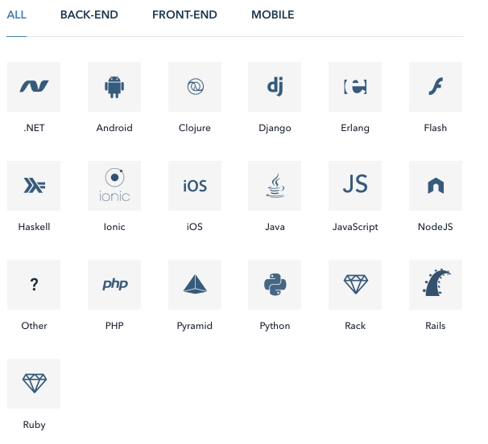

# 錯誤處理 (error handle)

### 實作注意事項

* 使用正確的 HTTP 狀態碼
* 自訂商業邏輯錯誤碼 (可選)
* 給開發者的錯誤訊息
* 給使用者的錯誤訊息

### HTTP 狀態碼

* [List of HTTP status codes - Wikipedia](https://en.wikipedia.org/wiki/List_of_HTTP_status_codes)
* [Biznet GIO FAQ - Choosing an HTTP Status Code](http://faq.biznetgiocloud.com/index.php?action=artikel&cat=1&id=240&artlang=en)

| 狀態碼     | 意義                                |
| :-------- | :--------------------------------- |
| 2xx       | 成功                                |
| 4xx       | 應用層級錯誤(常見 400, 401, 403, 404) |
| 5xx       | 非預期的錯誤(常見 500, 503)           |

### 單筆錯誤訊息

**Github Style**

```
Request URL: https://api.github.com/user
Request Method:GET
Status Code:401 Unauthorized

{
  "message": "Requires authentication",
  "documentation_url": "https://developer.github.com/v3"
}
```

**Facebook style**

```
{
  "error": {
    "message": "Message describing the error",
    "type": "OAuthException",
    "code": 190,
    "error_subcode": 460,
    "error_user_title": "A title",
    "error_user_msg": "A message",
    "fbtrace_id": "EJplcsCHuLu"
  }
}
```

### 多筆錯誤訊息

**Github Style**

```
{
  "message": "Validation Failed",
  "errors": [
    {
      "resource": "Issue",
      "field": "title",
      "code": "missing_field"
    }
  ]
}
```

**Twitter style**

```
{
  "errors": [
    {
      "message": "Sorry, that page does not exist",
      "code": 34
    }
  ]
}
```

### 錯誤追蹤工具

<!--  主動式追 bug -->

* [Rollbar - Error Tracking Software for Ruby, Python, JavaScript, more](https://rollbar.com/)
* [Sentry.io - Track errors with modern exception logging for JavaScript, Python, Ruby, Java, and Node.js](https://sentry.io/welcome/)

### Rollvar

* 支援多種語言
* [Rollbar Documentation](https://rollbar.com/docs/)
* [Community-maintained libraries](https://rollbar.com/docs/items_other/)
* 介紹影片：[Rollbar Error Monitoring for Atlasssian - YouTube](https://www.youtube.com/watch?v=7AMWB3KnNSs)

<!-- 大概 demo 一下程式碼，還有 UI 介面 -->

**支援的語言**



**實作方式**

```
var rollbar = require("rollbar");

// rollbar.init("your-access-token");

rollbar.init("your-access-token", {
  environment: "staging",
  endpoint: "https://api.rollbar.com/api/1/"
});

rollbar.reportMessage("Hello world!");
```

**問題**

* 為什麼需要錯誤追蹤工具？

<!--
* Error 淹沒在一堆 log 中不好查，甚至可能被洗掉了。
* log 裡面記錄的東西資訊很少，又沒有很好的介面可以查詢。
* 有些訊息應該被 client 端就被拋出，這樣才能完整的資訊。
* 沒有整合通知
 -->

### 延伸閱讀

* [Restful API 中的错误处理 | Scarletsky](http://scarletsky.github.io/2016/11/30/error-handling-in-restful-api/)
* [程式設計 - 簡明RESTful API設計要點 - Twincl](https://tw.twincl.com/programming/*641y)
* [The Complete Guide to Error Tracking Tools: Rollbar vs Raygun vs Sentry vs Airbrake vs Bugsnag vs OverOps | Takipi Blog](http://blog.takipi.com/the-complete-guide-to-error-tracking-tools-rollbar-vs-raygun-vs-sentry-vs-airbrake-vs-bugsnag-vs-overops/)
