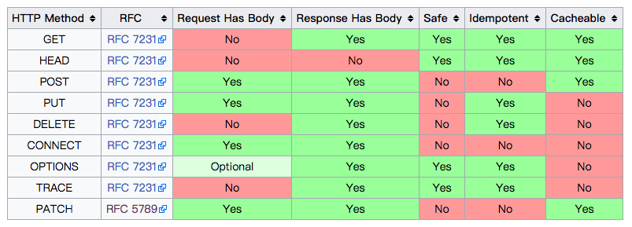

# HTTP Method

| HTTP Methods | 意義                                             |
| :----------- | :----------------------------------------------- |
| GET          | 讀取資源 (safe & idempotent)                      |
| HEAD         | 與 GET 功能相同，但不會回傳 Body                     |
| POST         | 新增資源                                          |
| PUT          | 替換資源 (idempotent) Replace (Create or Update)  |
| DELETE       | 刪除資源 (idempotent)                             |

<!--
| TRACE        |                                                  |
| OPTIONS      |                                                  |
| CONNECT      |                                                  |
 -->

* [RFC2616](https://tools.ietf.org/html/rfc2616): Hypertext Transfer Protocol (HTTP)
* [RFC2617](https://tools.ietf.org/html/rfc2617): HTTP Authentication: Basic and Digest Access Authentication

**延伸閱讀**

* [Hypertext Transfer Protocol — HTTP/1.1](https://www.w3.org/Protocols/rfc2616/rfc2616.html)
* [HTTP/1.1协议更新：RFC 2616遭废弃](http://www.infoq.com/cn/news/2014/06/http-11-updated)
* [HTTP - Hypertext Transfer Protocol Overview](https://www.w3.org/Protocols/)

### 定義

> The set of common methods for HTTP/1.1 is defined below. Although this set can be expanded, additional methods cannot be assumed to share the same semantics for separately extended clients and servers. >>>  [HTTP/1.1: Method Definitions](https://www.w3.org/Protocols/rfc2616/rfc2616-sec9.html)

HTTP 1.1 定義了以下一系列的常見的 methods，為了分離 clients 和 servers，雖然這些 method 可以被擴充、添加，但不可以假定共用相同的語意。

> This document has been superseded. In 2014, RFC2616 was replaced by multiple RFCs (7230-7237)

**延伸閱讀**

* [HTTP/1.1: Method Definitions](https://www.w3.org/Protocols/rfc2616/rfc2616-sec9.html)

### Safe and Idempotent Methods

資料來源：[Hypertext Transfer Protocol - Wikipedia](https://en.wikipedia.org/wiki/Hypertext_Transfer_Protocol)

**Safe Methods**

> Safe methods are HTTP methods that do not modify resources. For instance, using GET or HEAD on a resource URL, should NEVER change the resource.

它不會改變 resources 的 HTTP mehtods，我們就叫它是 Safe mehtods。例如 GET 或 HEAD 從不改變 resources。

**Idempotent(冪等) Methods**

> An idempotent HTTP method is a HTTP method that can be called many times without different outcomes. It would not matter if the method is called only once, or ten times over. The result should be the same. Again, this only applies to the result, not the resource itself. This still can be manipulated like an update-timestamp, provided this information is not shared in the (current) resource representation.

一個 HTTP mehtod 可以被呼叫多次，每次都會取得相容的結果，我們就叫它是 idempotent HTTP method。不論被呼叫一次或多次，結果都會相同。這只適用在回應結果不是，不是指 resource 本身。仍然可以控制像是 update-timestamp，提供此資訊但不能在資源呈現時共享。

<!-- idempotent 的意思是如果相同的操作一再重複執行，結果還是跟第一遍的結果一樣，根據 HTTP 的規格，只有 POST、PATCH、CONNECT 不是 idempotent，POST 再執行一遍，會再新增一筆資料，PATCH 則是有不能保證 idempotent 的可能性。Idempotent 特性，則是會影響可否 Retry。 -->

資料來源: [REST cook book - What are idempotent and/or safe methods?](http://restcookbook.com/HTTP%20Methods/idempotency/)

**Cacheable Methods**

> Request methods can be defined as "cacheable" to indicate that responses to them are allowed to be stored for future reuse; for specific requirements see [RFC7234](https://tools.ietf.org/html/rfc7234).  In general, safe methods that do not depend on a current or authoritative response are defined as cacheable; this specification defines GET, HEAD, and POST as cacheable, although the overwhelming majority of cache implementations only support GET and HEAD.

Request methods 可以被 cache 並允許儲存作為未來重複使用的規定在於 [RFC7234](https://tools.ietf.org/html/rfc7234)。一般來說，safe methods 跟 cacheable 沒有絕對關聯，在規格中定義了 GET, HEAD, and POST 可以被 cache，但大多數的 cache 指支援 GET 和 HEAD。

### Compare GET vs. POST

* GET 可以被加入瀏覽器歷史紀錄，反之 POST 不行。
* GET 可以被加入瀏覽器書籤，反之 POST 不行。
* POST 相對比 GET 安全性高，因為不會被 cache，也不會顯示在瀏覽器歷史紀錄中，及 server log 中。
* GET 不能用來傳送需要安全性高的資料
* GET 應該只被用在取得資料
* GET 有資料長度的限制，因為 URL 的長度最大只資源 2048 characters。
* GET 參數會顯示在 URL 上，反之 POST 不會。
<!-- 如果用 HTTP GET 來傳送密碼，會被記錄在 log -->

資料來源: [w3c school - HTTP Methods: GET vs. POST](https://www.w3schools.com/tags/ref_httpmethods.asp)

**問題**

* 應該用 HTTP GET 來傳的參數，用 HTTP POST 來傳，會導致什麼問題？

<!-- 無法被放置在 HTML 超連結中 -->
<!-- 不會在瀏覽器留下紀錄 -->
<!-- 不被加入書籤 -->
<!-- 應該被記錄在 server log 的參數資訊，沒被 log 住 -->
<!-- 違反 HTTP 協定的定義，無法切割 Client 和 Server 之間的相依性。 -->

### Compare PUT vs. PATCH

* PUT: 更新全部內容，若資料之前不存在，則新增一筆。
* PATCH: 這是後來才追加的 mehtod，更新資源部份內容。
  * [RFC 5789 - PATCH Method for HTTP](https://tools.ietf.org/html/rfc5789)

**問題**

* HTTP PUT 會用到的情境是？

<!--  /subscribe/已知ID -->

### Compare PUT vs. POST

**延伸閱讀**

* [restcookbook - When should we use PUT and when should we use POST?](http://restcookbook.com/HTTP%20Methods/put-vs-post/)

### RFC 7230 ~ 7237

* [RFC 7230](https://tools.ietf.org/html/rfc7230): Message Syntax and Routing
* [RFC 7231](https://tools.ietf.org/html/rfc7231): Semantics and Content
* [RFC 7232](https://tools.ietf.org/html/rfc7232): Conditional Requests
* [RFC 7233](https://tools.ietf.org/html/rfc7233): Range Request
* [RFC 7234](https://tools.ietf.org/html/rfc7234): Caching
* [RFC 7235](https://tools.ietf.org/html/rfc7235): Authentication
* [RFC 7236](https://tools.ietf.org/html/rfc7236): Initial HTTP Authentication Scheme Registrations
* [RFC 7237](https://tools.ietf.org/html/rfc7237): Initial HTTP Method Registrations
* [RFC 7238](https://tools.ietf.org/html/rfc7238): the 308 status code
* [RFC 7239](https://tools.ietf.org/html/rfc7239): Forwarded HTTP extension

**更動範圍說明(只列出重點項目)**

1. 對如何處理不應該出現的空格進行了規定，將能修復 HTTP Response Splitting 漏洞
1. 每服務器兩個連接的限制被移除
1. 不再支持 HTTP/0.9
1. 默認編碼不再是 ISO-8859-1
1. 服務器不再被強制要求處理所有 `Content-*` 請求頭內容
1. PUT請求頭禁止使用Content-Range
1. 如果引用頁不存在，建議在請求頭裡使用 about:blank 這個URI，以便對「沒有引用頁」和「我不想發送引用頁」加以區別
1. 狀態碼 204, 404, 405, 414 和501現在可以緩存了（cachable）
1. 狀態碼 301 和 302 現在允許用戶代理（user-agent）將請求方式從POST改為GET。雖然原標準不允許，但人們其實早就在這樣做了，標準適應現實，這是個很好的例子。
1. 請求頭的 Location 現在可以包含相對URI和片段標識符（fragment identifiers）
1. Content-MD5 被移除

### 延伸閱讀

* [常見的 HTTP Method 的不同性質分析：Get, Post 和其他4種 Method 的差別 | Learning by Hacking](http://data-sci.info/2015/10/24/%E5%B8%B8%E8%A6%8B%E7%9A%84http-method%E7%9A%84%E4%B8%8D%E5%90%8C%E6%80%A7%E8%B3%AA%E5%88%86%E6%9E%90%EF%BC%9Agetpost%E5%92%8C%E5%85%B6%E4%BB%964%E7%A8%AEmethod%E7%9A%84%E5%B7%AE%E5%88%A5/)
* [真。淺談 RESTful API by Triton Ho | 閃亮亮大師之路](http://blog.dj1020.net/%E7%9C%9F%E3%80%82%E6%B7%BA%E8%AB%87_RESTful_API_by_Triton_Ho/)
