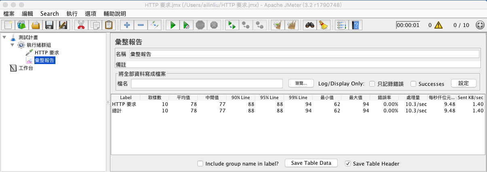

# JMeter

* Apache JMeter 是一個100％的純Java視窗應用程式，用於壓力測試和性能測量的工具。它最初被設計用於Web應用程式的測試，但後來擴展到其他測試領域。
* 可以執行Http、FTP、RDBMS(關聯式資料庫)、LDAP、SOAP與WebService等的負載以及效能測試

[下載](http://jmeter.apache.org/download_jmeter.cgi)

<https://jsonplaceholder.typicode.com/>

<!--
http://conbar.pixnet.net/blog/post/19034101-open-source-%E5%A3%93%E5%8A%9B%E6%B8%AC%E8%A9%A6%E5%B7%A5%E5%85%B7---apache-jmeter
-->