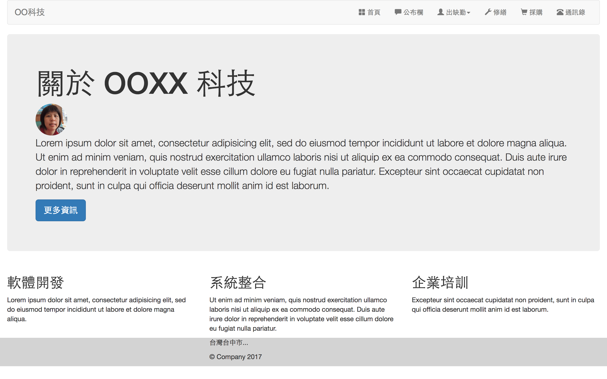

# 元件 (Components)


### 導覽列 (Navigation Bar)

**類別**

* navbar
* navbar-default
* navbar-inverse
* navbar-header
* navbar-brand
* navbar-nav
* navbar-right
* navbar-left


```html
<nav class="navbar navbar-default">
  <div class="container-fluid">
    <div class="navbar-header">
      <a class="navbar-brand" href="#">LOGO</a>
    </div>
    <div class="navbar">
      <ul class="nav navbar-nav">
        <li><a href="#">Menu1</a></li>
        <li><a href="#">Menu2</a></li>
        <li><a href="#">Menu3</a></li>
        <li><a href="#">Menu4</a></li>
        <li><a href="#">Menu5</a></li>
      </ul>
    </div>
  </div>
</nav>
```

[官方文件傳送門](http://getbootstrap.com/components/#navbar)


**導覽列 (Navigation Bar) 與下拉式選單 (Dropdown)**

```html
<li class="dropdown">
  <a href="#" class="dropdown-toggle" data-toggle="dropdown" role="button" aria-haspopup="true" aria-expanded="false">母分類<span class="caret"></span></a>
  <ul class="dropdown-menu">
    <li><a href="#">子分類 1</a></li>
    <li><a href="#">子分類 2</a></li>
  </ul>
</li>
```

**Jumbotron**

```html
<div class="jumbotron">
  <h1>jumbotron title</h1>
  <p>desc</p>
  <p><a class="btn btn-primary btn-lg" href="#" role="button">more</a></p>
</div>
```

[官方文件傳送門](http://getbootstrap.com/components/#jumbotron)

## 練習題



* 建立一個完整 layout 的網站
  * 包 container
  * 加 navbar
  * 加 image RWD
  * 加漢堡包
  * 加 icon
  * navbar 加下拉選單

<!--

預告下次上課，我們將介紹更多的元件，及更多的練習，並開始使用 Javascript，將我們的網頁動起來，並帶到一點 CSS 預處理器的觀念，及如何使用佈景主題。

-->

**延伸閱讀**
