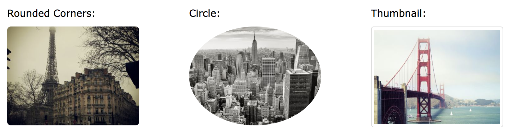

# 圖片(Image)



**class**

* img-rounded
* img-circle
* img-thumbnail
* img-responsive

**圖文區塊**

```
<div class="thumbnail">
  <a href="/w3images/lights.jpg">
    
    <div class="caption">
      <p>Lorem ipsum...</p>
    </div>
  </a>
</div>
```

**練習題**

* 建立一個一列三欄的圖文區塊

**延伸閱讀**

* [Bootstrap Images](http://www.w3schools.com/bootstrap/bootstrap_images.asp)
