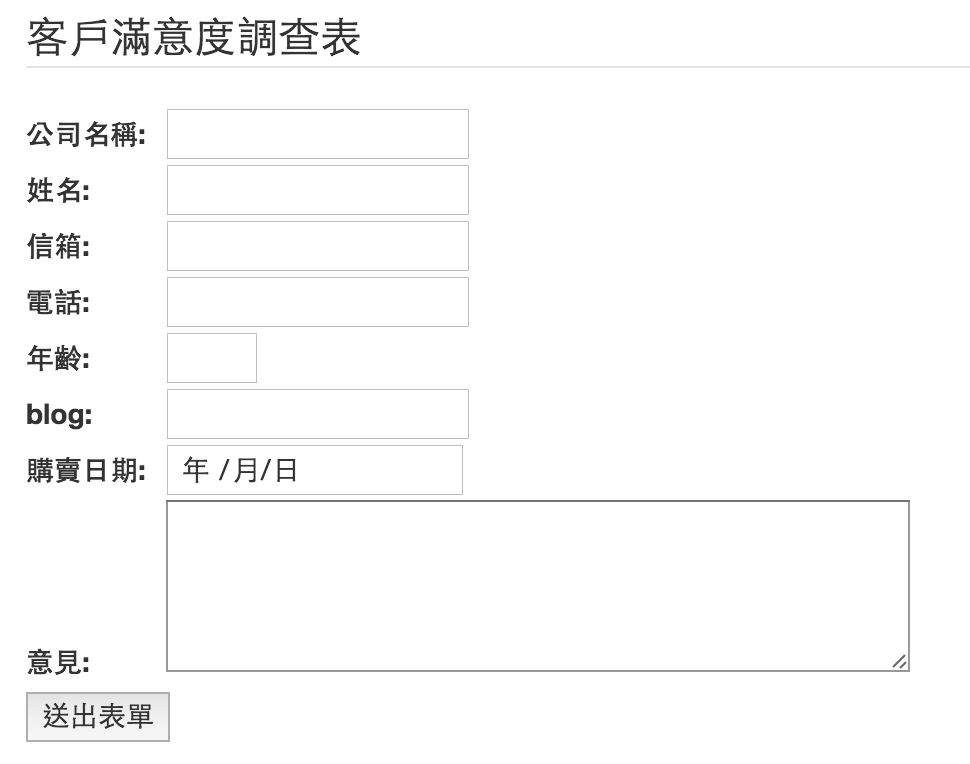

# 表單 (form)

* 註冊一個 [codepen](https://codepen.io/)

**html5基本宣告**

```
<!DOCTYPE html>
<html>
<body>
<form action="#">
  公司名稱: <input type="text" name="company"><br>
  姓名:</label><input type="text" name="fullname"><br>
  意見:</label><textarea name="comment" rows="4" cols="50"><br>
  <input type="submit" value="送出表單">
</form>
</body>
</html>
```

**加入新的 input type**

* email
* url
* date
* number
* tel

**填入格式檢查**

* 修改警告訊息內容

**練習題**

* 依照下面的圖示，建立一個「客戶滿意度調查表」表單，並使用新的 input 元素的檢查功能。



<!--
<form action="#">
  <fieldset>
    <legend>客戶滿意度調查表</legend>
    <label>公司名稱:</label><input type="text" name="company"><br>
    <label>姓名:</label><input type="text" name="fullname"><br>
    <label>信箱:</label><input type="email" name="email"><br>
    <label>電話:</label><input type="tel" name="tel"><br>
    <label>年齡:</label><input type="number" name="age" min="1" max="100" ><br>
    <label>blog:</label><input type="url" name="url"><br>
    <label>購買日期:</label><input type="date" name="date"><br>
    <label>意見:</label><textarea name="comment" rows="4" cols="50"></textarea><br>
    <input type="submit" value="送出表單">
  </fieldset>
</form>
-->

<!--
body {
  padding: 20px;
}
label{
  width:70px;
}
-->
