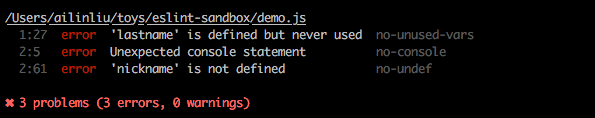

# ESlint

JavaScript 程式碼檢查工具

**起源**

大多數需編譯的語言來說在編譯程序時，就會檢查程式碼，但 JavaScript 不需要編譯，透過使用 ESLint 這樣的工具，可以補足這一塊缺點。

**原理**

掃描程式碼，找出可能發生的問題。

**好處**

避免在執行過程才發現問題，提升程式碼的品質。

**參考資料**

* <http://eslint.org/>
* <http://eslint.cn/>
* [List of available rules - ESLint - Pluggable JavaScript linter](http://eslint.org/docs/rules/)

**常用指令**

```
npm install eslint -g
eslint --init
eslint demo.js
eslint folder1
eslint folder1 folder2 demo.js
```

### 範例



```js
function greet(firstname, lastname){
    console.log('hi ' + firstname + ', your nickname is ' + nickname);
}

greet('ailin');
```

**.eslintrc.js**

```json
module.exports = {
    "env": {
        "browser": true
    },
    "extends": "eslint:recommended",
    "rules": {
        "indent": [
            "error",
            4
        ],
        "linebreak-style": [
            "error",
            "unix"
        ],
        "quotes": [
            "error",
            "single"
        ],
        "semi": [
            "error",
            "always"
        ]
    }
};
```