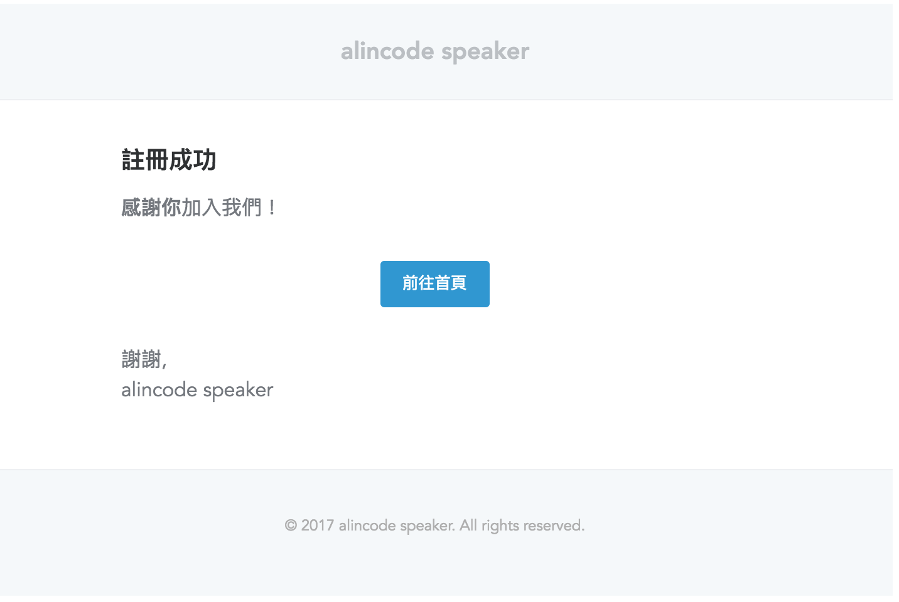

# 發信

<https://laravel.com/docs/5.4/mail#introduction>

1. 安裝 Driver (選項)
1. 修改 .env 並清除 config cache
1. 用 artisan 快速建立初始化檔案
1. 建立 MailController
1. 建立 Route
1. 建立 View
1. 測試是否 work

### 安裝 Driver (選項)

* smtp
* sendmail
* mailgun
* mandrill
* AWS ses
* ...

```
composer require guzzlehttp/guzzle
```

### 相關檔案位置

* .env
* config/mail.php
* config/service.php
* app/Mail/
* resources/views/emails/

[Mailtrap.io — Fake smtp testing server. Dummy smtp email testing](https://mailtrap.io/)

### 修改 .env

若 MAIL_USERNAME 和 MAIL_PASSWORD 為空值，則會使用 mail.php 內設定。

```
MAIL_FROM_ADDRESS="admin@admin.com"
MAIL_FROM_NAME=Admin
```

**Mailtrap**

```
MAIL_DRIVER=smtp
MAIL_HOST=smtp.mailtrap.io
MAIL_PORT=2525
MAIL_USERNAME=null
MAIL_PASSWORD=null
MAIL_ENCRYPTION=null
```

**Gmail**

```
MAIL_DRIVER=smtp
MAIL_HOST=smtp.gmail.com
MAIL_PORT=587
MAIL_USERNAME=your@gmail.com
MAIL_PASSWORD=yourpassword
MAIL_ENCRYPTION=tls
```

**修改 Gmail 安全性設定**

允許安全性較低的應用程式設定，<https://www.google.com/settings/security/lesssecureapps> 登入後設為**啟用**。

**清除 cache**

```
php artisan config:cache
```

### 用 artisan 快速建立初始化檔案

```
php artisan make:controller MailController
```

#### 純文字 / HTML

```
php artisan make:mail NewUserWelcome
```

```php
<?php

namespace App\Mail;

use Illuminate\Bus\Queueable;
use Illuminate\Mail\Mailable;
use Illuminate\Queue\SerializesModels;
use Illuminate\Contracts\Queue\ShouldQueue;

class NewUserWelcome extends Mailable
{
    use Queueable, SerializesModels;

    public function __construct()
    {
    }

    public function build()
    {
        return $this->view('view.name');
    }
}
```

**傳值**

```php
public function build()
{
    return $this->text('view.name')->with([
        'name' => '劉小姐'
    ]);
}
```

**共存**

```php
public function build()
{
    return $this->text('emails.text.user.newuserwelcome')->view('emails.html.user.newuserwelcome')->with([
        'name' => '劉小姐'
    ]);  
}
```

#### Markdown



```
php artisan make:mail NewUserWelcome --markdown=emails.markdown.user.newuserwelcome
```

```php
public function build()
{
    return $this->markdown('view.name');
}
```

### 建立 Route

```php
// routes/web.php
Route::get('/send','MailController@send');
```

### 建立 MailController

```
php artisan make:controller MailController
```

```php
<?php

namespace App\Http\Controllers;

use App\Mail\NewUserWelcome;
use Illuminate\Support\Facades\Mail;
use Illuminate\Http\Request;


class MailController extends Controller
{
    public function send()
    {
        Mail::to('alincode@gmail.com')->send(new NewUserWelcome());
    }
}
```

### 練習題

新增註冊成功信

1. Markdown 格式
1. 使用純文字
1. 使用自訂 Html 格式
1. 添加到 RegisterController 中

<!-- 1. 信件中添加附件 -->

<!-- [Laravel 5 使用 Gmail 寄信 | kckct’s notes](https://kckct.wordpress.com/2016/03/19/laravel5_send_email_using_gmail/) -->

