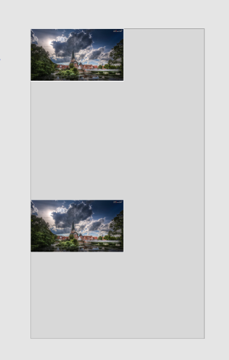

# 動畫
流暢、有意義的動畫對於移動應用用戶體驗來說是非常重要的。  
現實生活中的物體在開始移動和停下來的時候都具有一定的慣性  
React Native提供了兩個互補的動畫系統：用於全局的佈局動畫LayoutAnimation  
和用於創建更精細的交互控制的動畫Animated。  
  
React Native 使用動畫上跟 React 網頁有顯著的差異  

## React - 使用 react-addons-css-transition-group

```javascript
var ReactCSSTransitionGroup = require('react-addons-css-transition-group');

render: function() {
  return (
    <ReactCSSTransitionGroup transitionName="example" transitionAppear={true} transitionAppearTimeout={500}>
      <h1>Fading at Initial Mount</h1>
    </ReactCSSTransitionGroup>
  );
}
```
CSS

```javascript
.example-enter {
  opacity: 0.01;
}

.example-enter.example-enter-active {
  opacity: 1;
  transition: opacity 500ms ease-in;
}
```

## React Native - 使用 Animated

Animated 使開發者可以非常容易地實現各種各樣的動畫和交互方式，並且具備極高的性能。 Animated 可以聲明的形式來定義動畫的輸入與輸出，在其中建立一個可配置的變化函數，然後使用簡單的 start / stop 方法來控制動畫按順序執行。
 Animated 封裝了四個可以動畫化的組件：View、Text、Image 和 ScrollView
 
 帶有淡入動畫效果的 Component：

```javascript
import React, { Component } from 'react';
import {
  Animated,
} from 'react-native';

export default class FadeInView extends Component {
  constructor(props) {
    super(props);
    this.state = {
      fadeAnim: new Animated.Value(0),
    };
  }
  componentDidMount() {
    this.show();
  }

  componentWillReceiveProps(nextProps) {
    if (nextProps.visible) {
      this.show();
    } else {
      this.hide();
    }
  }
  
  show = () => {
    Animated.timing(
      this.state.fadeAnim,
      {
        toValue: 1,
      }
    ).start();
  }
  
  hide = () => {

  }
  
  render() {
    return (
      <Animated.View 
        style={{
          ...this.props.style,
          opacity: this.state.fadeAnim,
        }}
      >
        {this.props.children}
      </Animated.View>
    );
  }
}
```

接下來就能使用 FadeInView 來做出淡入的 View 了

```javascript
import FadeInView from './FadeInView'

<FadeInView style={{width: 250, height: 50, backgroundColor: 'powderblue'}}>
  <Text style={{fontSize: 28, textAlign: 'center', margin: 10}}>Fading in</Text>
</FadeInView>
```

練習ㄧ: 對 FadeInView 傳入 props visible 根據 visible 淡入淡出

練習二: 寫一個 MoveRightView 會慢慢滑動到右邊的動畫
```
transform: [
  { translateX: this.state.xPosition },
]
```

### timing

duration: 動畫持續時間，預設 500 ms  
easing: 動畫過度曲線，預設值: Easing.inOut(Easing.ease)，[支援曲線](https://reactnative.cn/docs/0.51/easing.html#content)，[曲線參考](http://xaedes.de/dev/transitions/)  
delay: 動畫持續時間  

練習三: 使用 MoveRightView 嘗試不同的過度曲線

### decay
推動一個值以一個初始的速度和一個衰減係數逐漸變為0。  
像是摩擦力的感覺。  
velocity: 初始速度，必填  
deceleration: 衰減係數，默認值0.997  

## 組合動畫
多個動畫可以通過 sequence（順序執行）、parallel（同時執行）來組合使用。它們中的每一個都接受一個要執行的動畫數組，並且自動在適當的時候調用 start / stop。舉個例子：

### sequence
按順序執行一個動畫陣列裡的動畫，等待一個完成後再執行下一個。如果當前的動畫被中止，後面的動畫則不會繼續執行。

左右來回動畫
```javascript
Animated.sequence([
  Animated.timing(this.state.xPosition, { toValue: 200 }),
  Animated.timing(this.state.xPosition, { toValue: 0 }),
]).start();
```

### loop(animations)

重複執行動畫
```javascript
Animated.loop(
  Animated.sequence([
    Animated.timing(this.state.xPosition, { toValue: 200 }),
    Animated.timing(this.state.xPosition, { toValue: 0 }),
  ]).start();
)
```

### interpolate
在更新屬性之前對值進行插值。譬如：把 0 - 1 映射到 0deg - 360deg。  
extrapolate: 可以使用clamp選項來阻止輸出值超過outputRange  

```javascript
const rotate = this.state.rotate.interpolate({
  inputRange: [0, 1],
  outputRange: ['0deg', '360deg'],
  extrapolate: 'clamp',
})
```


練習四: 做一個簡單的旋轉 loading 動畫
```javascript
transform: [
  {
    rotate: '45deg',
  },
]
```


# 動畫 + UI 互動


## Animated.event

這個方法用來把一組數據匹配到動畫需要的數據上  
onScroll 會回傳 ScrollView 捲動的 CallBack  
這邊能讓 Y 軸捲動會對應到 this.scrollY

```javascript
<ScrollView
  scrollEventThrottle={1}
  onScroll={Animated.event(
    [{
      nativeEvent: {
        contentOffset: {
          y: this.scrollY 
        }
      }
    }]
  )}
>
</ScrollView>
```

### event範例

```
import React, { Component } from 'react';
import { Text, View, Animated, ScrollView, Dimensions } from 'react-native';
const ScreenWidth = Dimensions.get('window').width;
const ScreenHeight = Dimensions.get('window').height;

export default class Hello extends Component {

  constructor(props) {
    super(props);
    this.state = {};
    this.scrollY = new Animated.Value(0);
  }

  render() {
    const opacity = this.scrollY.interpolate({
      inputRange: [0, 300],
      outputRange: [1, 0],
      extrapolate: 'clamp',
      useNativeDriver: true
    });

    return (
      <View style={{ flex: 1 }}>
        <Animated.View
          style={{ opacity, width: '100%', height: 100, backgroundColor: 'blue' }}
        />
        <ScrollView
          style={{ flex: 1 ,backgroundColor:'#ebebeb', width: ScreenWidth, height: ScreenHeight}}
          scrollEventThrottle={1}
          onScroll={Animated.event(
            [{
              nativeEvent: {
                contentOffset: {
                  y: this.scrollY 
                }
              }
            }]
          )}
        >
          <View style={{ height: 1000, backgroundColor: '#ccc' }}></View>
        </ScrollView>
      </View>
    );
  }
}
```

練習五: 使用 Animated.event ScrollView 搭配 View 完成視差效果

效果一


效果二


## Shared Element Transition 功能實作

1. 跳轉頁面  


  
2. 複製一個圖片 Component 並且縮放到指定的位置


3. 移動圖片到對應位置

```javascript
transform: [{
  translateX: moveTopX,
}, {
  translateY: moveTopY,
}]
```



4. 縮放 image 到跟 detail 內 image 一樣寬高


### 圖片清單

- ref 等於是 Component 的 id，可以用 ref 找到該元件
- `image.getNode().measure` 可以拿到元件資訊
- `flexWrap: 'wrap'` 超出螢幕寬度換行
- onScroll 可以拿到捲動位置

AnimateList.js
```javascript
import React, { Component } from 'react';
import { Text, View, Animated, ScrollView, TouchableOpacity, Image} from 'react-native';
import AnimateTransition from './AnimateTransition';
import { Actions } from 'react-native-router-flux';

const template = ['40%', '60%', '50%', '50%', '100%', '60%', '40%', '40%', '60%', '50%', '50%', '60%', '40%', '100%'];

export default class Hello extends Component {
  constructor(props) {
    super(props);
    this.state = {
      tW: 0,
      tH: 0,
      tX: 0,
      tY: 0,
      tUri: '',
    };
    this.scrollViewPosition = 0;
    this.image = {}
  }

  getImagePosition = (image, w, uri) => {
    if (image) {
      image.getNode().measure((soruceX, soruceY, width, height, pageX, pageY) => {
        console.log({ width, height, pageX, pageY });
        this.setState({
          tW: w,
          tH: height,
          tX: pageX,
          tY: pageY,
          tUri: uri,
        });
      });
    }
  }

  renderImage = () => {
    return template.map((w, i) => {
      const imageId = 900 + i;
      const uri = `https://picsum.photos/256/144/?image=${imageId}`;
      Image.prefetch(uri);
      return (
        <TouchableOpacity
          key={i}
          style={{ width: w, height: 200, padding: 2 }}
          onPress={() => {
            this.getImagePosition(this.image[i], w, uri );

          }}
        >
          <Animated.Image
            style={{
              flex: 1
            }}
            ref={ref => (this.image[i] = ref)}
            source={{ uri }}
            resizeMode={'cover'}
          />
        </TouchableOpacity>
      )
    })
  }

  render() {
    const { tW, tH, tX, tY, tV, tUri, scrollViewPosition } = this.state;
    return (
      <ScrollView
        scrollEventThrottle={16}
        onScroll={(e) => {
          console.log(e.nativeEvent.contentOffset.y);
        }}
      >
        <View
          style={{
            flexDirection: 'row',
            flexWrap: 'wrap',
          }}
        >
          {this.renderImage()}
          <AnimateTransition
            width={tW}
            height={tH}
            x={tX}
            y={tY}
            image={tUri}
          />
        </View>
      </ScrollView>
    );
  }
}
```

### 轉場效果


AnimateTransition.js
```javascript
import React, { Component } from 'react';
import {
  Animated,
} from 'react-native';
import { Actions } from 'react-native-router-flux';

export default class AnimateTransition extends Component {
  constructor(props) {
    super(props);
    this.fadeAnim = new Animated.Value(0);
  }
  
  show = () => {
    this.fadeAnim = new Animated.Value(0);
    Animated.timing(this.fadeAnim, {
      toValue: 1,
      duration: 250,
    }).start();
  }

  componentWillReceiveProps(nextProps) {
    if (nextProps.image !== this.props.image) {
      this.show();
    }
  }
  
  render() {

    return (
      <Animated.View
        style={{
          opacity: this.fadeAnim,
          backgroundColor: 'red',
          position: 'absolute',
          left: this.props.x,
          top: this.props.y,
          width: this.props.width,
          height: this.props.height,
        }}
        source={{ uri: this.props.image }}
      />
    );
  }
}
```

## LayoutAnimation

LayoutAnimation允許你在全局範圍內創建和更新動畫，這些動畫會在下一次渲染或佈局週期運行。  
它常用來更新flexbox佈局，因為它可以無需測量或者計算特定屬性就能直接產生動畫。  
尤其是當佈局變化可能影響到父節點時，如果不使用LayoutAnimation，可能就需要顯式聲明組件的坐標，才能使得所有受影響的組件能夠同步運行動畫。  

```
import React from 'react';
import {
  NativeModules,
  LayoutAnimation,
  Text,
  TouchableOpacity,
  StyleSheet,
  View,
} from 'react-native';

const { UIManager } = NativeModules;

UIManager.setLayoutAnimationEnabledExperimental &&
  UIManager.setLayoutAnimationEnabledExperimental(true);

export default class App extends React.Component {
  state = {
    w: 100,
    h: 100,
  };

  _onPress = () => {
    // Animate the update
    LayoutAnimation.spring();
    this.setState({w: this.state.w + 15, h: this.state.h + 15})
  }

  render() {
    return (
      <View style={styles.container}>
        <View style={[styles.box, {width: this.state.w, height: this.state.h}]} />
        <TouchableOpacity onPress={this._onPress}>
          <View style={styles.button}>
            <Text style={styles.buttonText}>Press me!</Text>
          </View>
        </TouchableOpacity>
      </View>
    );
  }
}

const styles = StyleSheet.create({
  container: {
    flex: 1,
    alignItems: 'center',
    justifyContent: 'center',
  },
  box: {
    width: 200,
    height: 200,
    backgroundColor: 'red',
  },
  button: {
    backgroundColor: 'black',
    paddingHorizontal: 20,
    paddingVertical: 15,
    marginTop: 15,
  },
  buttonText: {
    color: '#fff',
    fontWeight: 'bold',
  },
});
```