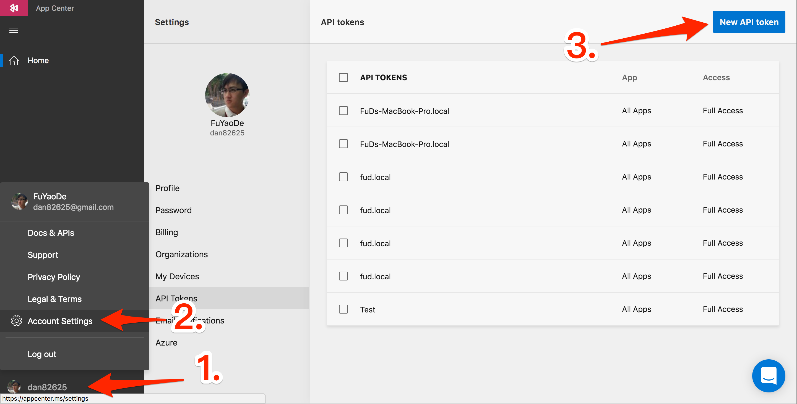
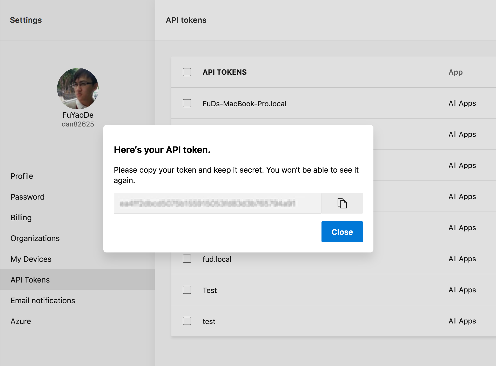

# Code Push

React Native 他有個特殊的功能，可以 Hot Deploy ，意思就是說可以上架完 App 後在更新程式碼，昨天有介紹到，打包 Apk 的時候需要先 Build 一個 Bundle.js ，這個 Bundle 裡面包含所有 UI 邏輯和商業邏輯，如果我們有一個 AWS 或是一個載點，能讓我們的 App 下載新的 Bundle.js 再重新載入的話，那樣就可以達到 Hot Deploy，更厲害一點可以進行所謂的 A/B Test，或是 Crash 降板。

# Install code-push-cli
```
npm install -g code-push-cli
```

# Register
https://appcenter.ms/create-account

## Get Token




## Login Cli

```
code-push login --accessKey <API TOKEN>
code-push whoami
```

# Get Key
```
code-push deployment ls <APP_CENTER_APP_NAME> -k
```
把 key 記下來

# Instatll Code Push
```
npm install react-native-code-push
react-native link react-native-code-push
```

android/app/src/main/res/values/strings.xml
```
<string moduleConfig="true" name="reactNativeCodePush_androidDeploymentKey">key</string>
```

# Usage

```
import codePush from "react-native-code-push";
class APP extends Component {
 ...
}
App = codePush({ installMode: codePush.InstallMode.IMMEDIATE })(App);
export default App;
```

# Release Patch

```
code-push release-react <APP_CENTER_APP_NAME> android -e index.js -o /tmp
```