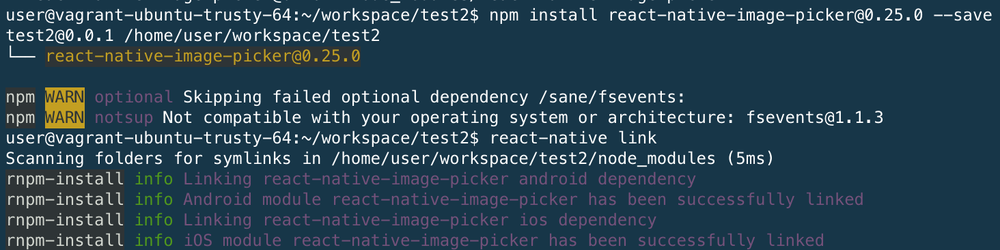

# Libraries
- 純 Component 的 Libraries 
- 包含原生程式碼的 Libraries
  - 使用 `react-native link` 設定套件，rnpm link 已棄用
  - 使用 `yarn add` 內建 `react-native link` 
  - 移除套件需要 `react-native unlink 套件名稱`，在移除 node module
  - link 套件後需 `react-native run-android` 重新編譯

## Sample 

android update sdk --no-ui --all --filter "tools,android-26,build-tools-26.0.0,platform-tools,android-26"

 /usr/lib/android-sdk-linux/tools/bin/sdkmanager --update 

[React Native Image Picker](https://github.com/react-community/react-native-image-picker)
```
npm install react-native-vector-icons@4.4.3 --save
react-native link 
```

### 成功畫面



```
// 可以用的 icon https://oblador.github.io/react-native-vector-icons/
import Icon from 'react-native-vector-icons/FontAwesome';

<Icon name={'search'} size={15} color={black} />
```