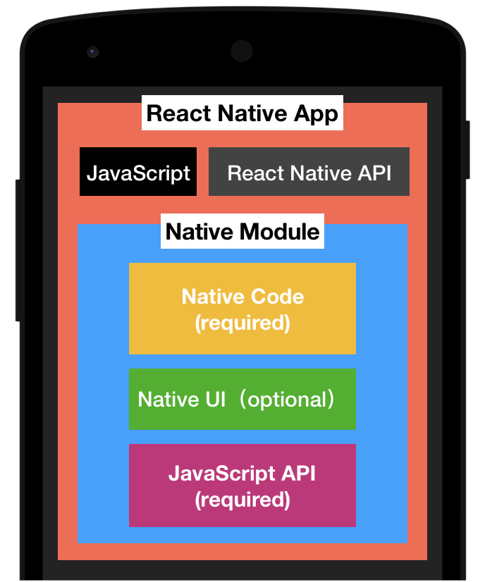

# Native Module - 原生模組

## 簡介

- 一組包含 Native Code(Java/Object-C) 與 React Native API(JavaScript) 的專案
- 可以包含 Native UI 元件
- 使用 ReactContent 取代原生 Content 物件
- 一個 Module Project 可以包含多個 Module 實作
- 有自己的資料回傳方式
  - Event (DeviceEventEmitter)
  - Promise (callback)

## 參考

- [Native Modules · React Native - Android](https://facebook.github.io/react-native/docs/native-modules-android.html)
- [Native Modules · React Native - iOS](https://facebook.github.io/react-native/docs/native-modules-ios.html)