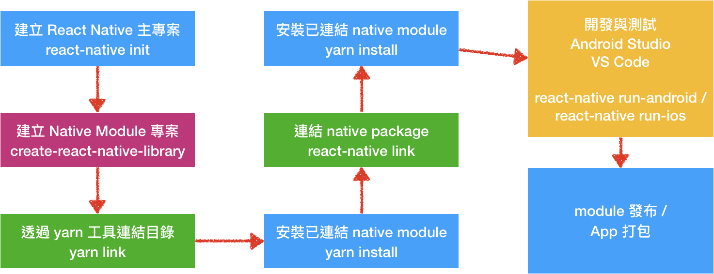
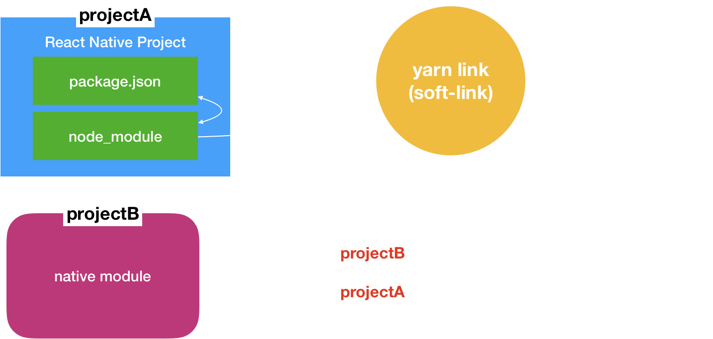
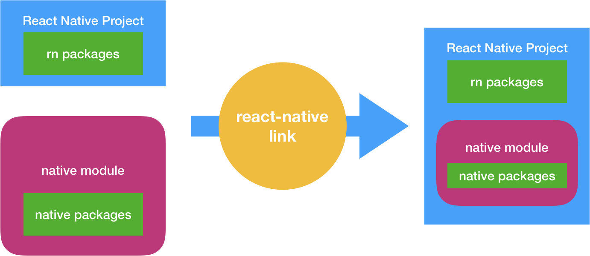

# 開發流程



> 注意：每次修改 native module，都要重新 install App。

## 使用 yarn link



---

## 使用 react-native link



---

## 引用 module

```javascript
  import { toast } from ‘react-native-my-module’;

  import { wifiManager } from ‘react-native-my-module’; 

  // 假設有 show() method
  toast.show();
```