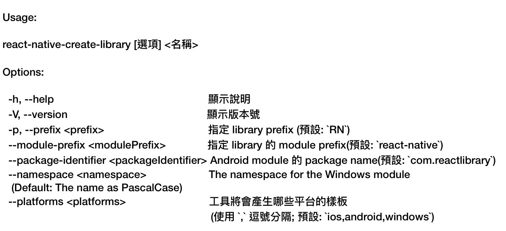

# 工具介紹

## 工具介紹

### react-native-create-library

- 支援 Android / iOS / Windows 平台
- 可以透過指令參數設定平台、模組名稱、package id 等屬性
- 不支援 UI module 建立，需要手動設定
- 對於 RN 專案沒有依賴性，可以獨立開發與發佈版本
- 不一定支援最新的 React Native 版本

### react-native-create-bridge

- Android 支援 Java/Kotlin
- iOS 支援 Obj-C/Swift
- 支援 native module 與 UI component 之 templating

### react-native new-library*

- react-native-cli 內建工具，沒有相容問題
- 只會自動建立 iOS 部分，不支援自動產生 Android 專案
- 需要手動 link
- 依賴於目前的 RN 專案，較難拆開單獨發布、維護
