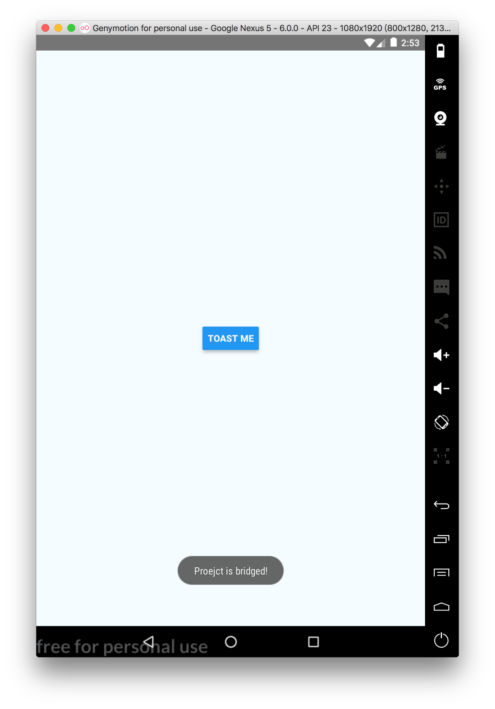

# 呼叫原生模組範例：使用 Toast

## 初始化專案 - 新增樣板與專案

### Native module 架構說明

一個支援 Android / iOS 雙平台的 Native Module 專案內應該會包含以下結構：

```markdown
.
├──node_module
├──ios
├──android
├──`{my_native_module}`
├──App.js
├──index.js
├──package.json
└──README.md
```

### 建立 RN 專案

首先，在開始製作 Native Module 之前，要先手動新建一個 React Native 專案。

```bash
# 1. create a React-Native APP project.(main project)
$ react-native init ProjectToast

# 2. create a React-Native MODULE project
$ cd ProjectToast && react-native-create-library ModuleMyToast --platforms android
```
---

## 原生程式撰寫 - Android

### 使用 **Android-Studio** 開啟以下目錄 `{ModuleMyToast}/android`。

```markdown
.
├──node_module
├──ios
├──android
├──{ModuleMyToast}/android
├──App.js
├──index.js
├──package.json
└──README.md
```

- RNModuleMyToastModule.java

```java
  // 宣告兩個常數儲存 Toast 的維持時間，以便輸出到 JavaScript
  private static final String DURATION_SHORT_KEY = "SHORT";
  private static final String DURATION_LONG_KEY = "LONG";

  // 宣告可以在 JavaScript 端可以使用的常數
  // getConstants() 不是必備方法
  // 以 Toast 來說，就是它的維持顯示時間
  // Toast.LENGTH_SHORT / Toast.LENGTH_LONG
  @Override
  public Map<String, Object> getConstants() {
    final Map<String, Object> constants = new HashMap<>();
    constants.put(DURATION_SHORT_KEY, Toast.LENGTH_SHORT);
    constants.put(DURATION_LONG_KEY, Toast.LENGTH_LONG);
    return constants;
  }
```

```java
  // 在 method 宣告 @ReactMethod 表示該方法將可以被 JavaScript 端存取
  // 由於 React Native 的 bridge 機制是非同步的，所以回傳必須是 void
  // 如果需要回傳，必須透過事件機制或是 callback 方法
  @ReactMethod
  public void show(String message, int duration) {
    // Java <----> JavaScript 參數對應類型：
    //        Boolean -> Bool
    //        Integer -> Number
    //        Double -> Number
    //        Float -> Number
    //        String -> String
    //        Callback -> function
    //        ReadableMap -> Object
    //        ReadableArray -> Array
    Log.d("RNModuleMyToast", message + " - " + duration);
    Toast.makeText(getReactApplicationContext(), message, duration).show();
  }
```

---

## 連結

```bash
# 1. link Module project and back to APP project to link them in path
$ cd ModuleMyToast && yarn link && cd .. && yarn link "react-native-module-my-toast"

# 2. install the linked module into APP project, and link packages
$ yarn install && react-native link “react-native-module-my-toast"
```

---

## 撰寫程式

```javascript
// 引入 RNModuleMyToast
import RNModuleMyToast from 'react-native-module-my-toast';
```

```javascript
  // 撰寫執行程式碼
  showToast = () => {
    console.log('RNModuleMyToast=>', RNModuleMyToast);
    RNModuleMyToast.show('Proejct and Module are bridged!', RNModuleMyToast.SHORT);
  }

  // 綁定按鈕
  render() {
    return (
      <View style={styles.container}>
        <Button
        title="TOAST ME"
        onPress={this.showToast}
        ></Button>
      </View>
    );
  }
```

## 執行

```bash
$ react-native run-android
```

## 結果



